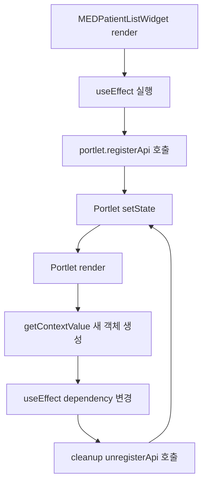

# Portlet API 등록 무한 렌더링

## 왜 중요한가

포틀릿 구조에서는 여러 위젯이 `registerApi`로 기능을 노출하고, 상위 `Portlet`이 이를 모아 상태와 기능을 조율한다.

이 구조에서 context 객체의 안정성을 잘못 판단하면, 단순 API 등록 코드가 렌더링 루프를 만들 수 있다.

## 증상

`MEDPatientListWidget` 렌더링 중 아래 경고가 발생했다.

```text
Warning: Maximum update depth exceeded
in MEDPatientListWidget
```

## 실제 원인

`MEDPatientListWidget`의 `useEffect`가 `portlet` context 객체를 dependency로 가지고 있었다.

`Portlet.getContextValue()`는 매 render마다 새 객체를 생성하고, `portlet.registerApi()`는 내부적으로 `setState`를 호출한다.

결과적으로 아래 루프가 생겼다.

```text
effect 실행
→ registerApi setState
→ Portlet render
→ 새 context object
→ MEDPatientListWidget effect dependency 변경
→ cleanup unregisterApi setState
→ effect 재실행
```

## 흐름 다이어그램



이 다이어그램에서 중요한 지점은 `registerApi` 자체가 `Portlet` state를 바꾼다는 점이다.

따라서 `portlet` context 객체 전체를 dependency로 잡으면 context 재생성과 API 등록이 서로를 계속 자극한다.

## 어떻게 해결했는가

`registerApi` effect는 mount/unmount 시 한 번만 실행되도록 하고, API 함수가 최신 `props`와 `portlet`을 읽어야 하는 값은 `ref`로 참조하게 했다.

핵심 패턴:

```js
const portletRef = React.useRef(portlet);
const propsRef = React.useRef(props);

portletRef.current = portlet;
propsRef.current = props;

React.useEffect(() => {
  const currentPortlet = portletRef.current;
  currentPortlet.registerApi(KEY, stableApi);

  return () => {
    currentPortlet.unregisterApi(KEY);
  };
}, [stableApi]);
```

## 기대효과

위젯 API 등록은 한 번만 수행하면서도, API 호출 시점에는 최신 context와 props를 읽을 수 있다.

렌더링 루프를 막고 포틀릿 위젯 간 API 연동 구조를 안정화한다.

## 재발 방지 전략

Portlet context 객체 전체를 hook dependency에 직접 넣지 않는다.

특히 effect 내부에서 `registerApi`, `unregisterApi`, `setState`처럼 Portlet state를 바꾸는 API를 호출하는 경우:

- effect dependency는 stable callback만 둔다.
- 최신 context/state/props는 `ref`로 읽는다.
- callback prop은 inline으로 넘기지 말고 `useCallback` 또는 `useMemo`로 고정한다.

## 기술적 성장 관점

React hook dependency 문제를 단순 무한 루프가 아니라, context identity와 포틀릿 API 등록 구조의 상호작용으로 분석했다.

이 경험은 “상태를 변경하는 effect는 dependency 안정성을 먼저 검증해야 한다”는 React 구조 설계 원칙으로 재사용할 수 있다.
