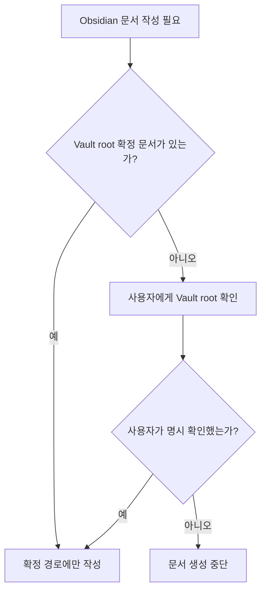

# Vault Root 추정 금지

## 왜 중요한가

Obsidian Vault는 장기 기억 저장소이므로 잘못된 경로에 문서를 만들면 지식이 분산되고, 이후 세션에서 기존 문서를 찾지 못하는 문제가 생긴다.

특히 `emr-ai-context`, `Personal`, 작업 디렉터리처럼 Vault처럼 보이는 경로가 있어도 실제 Vault root라는 보장은 없다.

## 증상

`second-brain-system`이 항상 적용되어야 하는 상황에서 Codex가 Obsidian Vault root를 확인하지 않고 현재 작업 위치를 Vault처럼 취급했다.

## 실제 원인

Vault root가 명시 확인되지 않았는데 `cwd`와 기존 Markdown 파일 존재를 근거로 추정했다.

이후 "Vault root 미확정이므로 기록하지 않음"으로 처리했지만, 스킬 규칙상 먼저 Vault root를 질문해야 했다.

## 잘못된 판단

작업 위치와 Obsidian Vault root를 같은 것으로 간주했다.

`alwaysApply: true`를 지키려면 즉시 기록해야 한다고 판단했고, 확인 질문 단계를 건너뛰었다.

## 어떻게 방지할 것인가

Vault root는 사용자가 명시적으로 확인한 경로만 사용한다.

현재 확정된 Vault root는 `[[settings/Vault Root 설정]]`에 기록된 `/Users/woosung/Documents/second-brain`이다.

Vault root가 불명확하면 작업을 멈추고 정확한 경로를 먼저 질문한다.

추정 경로에 파일을 만들었으면 경로와 사유를 공개하고 삭제 또는 이동 여부를 사용자에게 확인한다.

## 판단 흐름



이 흐름에서 중요한 지점은 “작업 위치”와 “Vault root”를 절대 같은 것으로 추정하지 않는 것이다.

## 기대효과

Vault 문서가 항상 같은 저장소에 축적되어 다음 세션에서 안정적으로 재사용된다.

작업 위치와 장기 기억 저장소를 혼동하지 않게 되어, 잘못된 문서 생성과 지식 분산을 줄일 수 있다.

## 관련 후속 작업

잘못 생성된 추정 경로 파일:

```text
/Users/woosung/Desktop/Amaranth10/emr-ai-context/Personal/강우성/failures/2026-05-14-medpatientlist-cache-and-grid-column.md
```

이 파일은 사용자 지시 없이 삭제하거나 이동하지 않는다.
