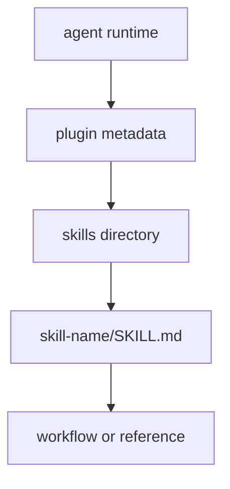
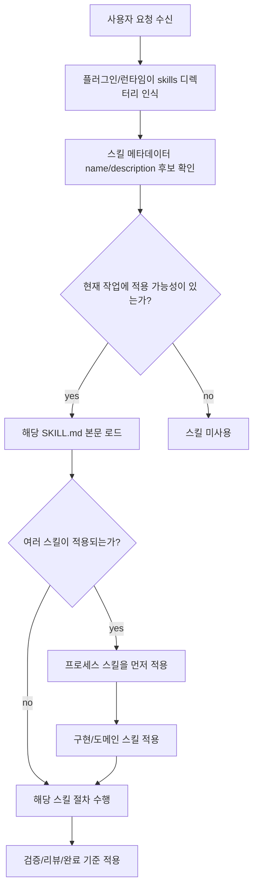
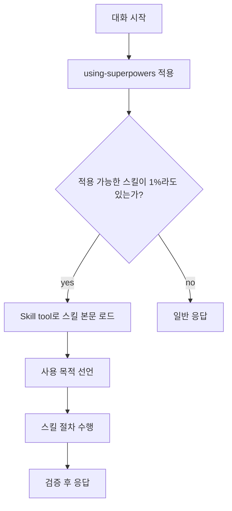
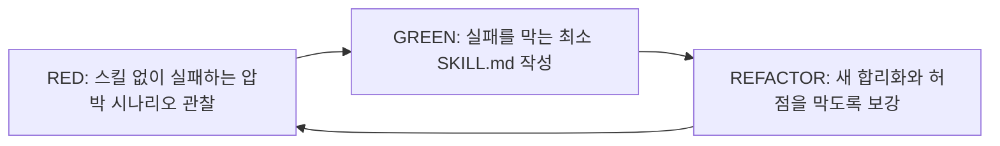

# 에이전트 스킬 구조와 검증 원칙

## 왜 필요한가

Codex나 Claude 같은 코딩 에이전트는 매번 긴 프롬프트를 다시 주입하는 방식만으로는 안정적인 작업 품질을 유지하기 어렵다. 반복되는 작업 방식, 검증 기준, 리뷰 절차, 문서화 원칙은 재사용 가능한 스킬로 분리해야 한다.

`obra/superpowers`는 이 문제를 스킬 묶음으로 푸는 예시다. 단순한 프롬프트 모음이 아니라, 설계, 계획, TDD, 디버깅, 리뷰, 완료 절차를 에이전트가 상황별로 불러와 사용하도록 만든 프로세스형 스킬 프레임워크다.

## 구조

Superpowers 저장소는 여러 에이전트 런타임에서 같은 스킬 묶음을 사용할 수 있도록 루트에 각 런타임용 메타데이터를 둔다.

- `.codex-plugin/plugin.json`: Codex 플러그인 메타데이터
- `.claude-plugin`: Claude용 플러그인 메타데이터
- `.cursor-plugin`: Cursor용 플러그인 메타데이터
- `.opencode`: OpenCode 연결 정보
- `gemini-extension.json`: Gemini CLI 확장 메타데이터
- `skills/`: 실제 스킬 본문 디렉터리

Codex 기준으로는 `.codex-plugin/plugin.json`의 `skills` 값이 `./skills/`를 가리킨다. 즉, 플러그인 메타데이터는 스킬 디렉터리를 등록하는 얇은 연결 계층이고, 실제 지식은 `skills/<skill-name>/SKILL.md`에 들어간다.



## 스킬 디렉터리 원칙

Superpowers의 `skills/`는 중첩 카테고리보다 flat namespace에 가깝다. 각 스킬은 하나의 디렉터리를 가지고, 그 안의 `SKILL.md`가 진입점이다.

예시 스킬은 다음 흐름으로 나뉜다.

- 계획과 협업: `brainstorming`, `writing-plans`, `executing-plans`, `dispatching-parallel-agents`, `subagent-driven-development`
- 리뷰와 브랜치 운영: `requesting-code-review`, `receiving-code-review`, `using-git-worktrees`, `finishing-a-development-branch`
- 엔지니어링 규율: `test-driven-development`, `systematic-debugging`, `verification-before-completion`
- 메타 스킬: `using-superpowers`, `writing-skills`

이 구조의 장점은 검색과 트리거가 단순하다는 점이다. 에이전트는 복잡한 폴더 분류를 따라가기보다, 현재 상황에 맞는 스킬 이름과 description을 보고 필요한 스킬을 고른다.

## SKILL.md 작성 원칙

`SKILL.md`의 frontmatter는 최소한 `name`, `description`을 가진다.

중요한 점은 `description`이 워크플로우 요약이 아니라 사용 조건이어야 한다는 것이다. description에 절차를 요약하면 에이전트가 본문을 읽지 않고 description만 보고 행동할 수 있다. 따라서 description은 “무엇을 하는 스킬인가”보다 “언제 이 스킬을 읽어야 하는가”에 집중해야 한다.

좋은 스킬 본문은 다음 요소를 짧게 가진다.

- 개요와 핵심 원칙
- 언제 사용하는가
- 핵심 패턴 또는 절차
- 빠르게 훑을 수 있는 기준표
- 필요한 경우 하나의 좋은 예시
- 흔한 실수와 방지 기준

큰 레퍼런스, 스크립트, 템플릿은 `SKILL.md`에 모두 넣지 않는다. 100줄 이상의 API 문서나 반복 실행 가능한 도구는 sibling file 또는 `scripts/`, `templates/` 같은 보조 파일로 분리한다.


## description은 어떻게 설정되는가

Superpowers에서 `description`은 사람이 읽는 요약문이 아니라, 에이전트가 스킬을 찾고 사용할지 판단하는 트리거 메타데이터에 가깝다.

그래서 좋은 `description`은 다음 조건을 가진다.

- `Use when...` 형태로 시작해 사용 조건을 바로 드러낸다.
- 스킬의 전체 절차를 요약하지 않는다.
- 에이전트가 실제로 마주치는 상황, 증상, 압박 조건, 작업 맥락을 적는다.
- 너무 추상적인 단어보다 검색 가능한 키워드와 증상을 포함한다.
- 특정 기술 전용 스킬이 아니라면 언어/프레임워크 이름에 과하게 묶지 않는다.
- 가능한 짧게 유지한다.

중요한 이유는 에이전트가 `description`만 보고 shortcut을 만들 수 있기 때문이다. 예를 들어 description에 “계획 실행 중 코드 리뷰를 한다”처럼 절차를 요약하면, 본문에 더 엄격한 2단계 리뷰 절차가 있어도 에이전트가 description만 따라 단순 리뷰 1회로 끝낼 수 있다.

따라서 description은 다음처럼 구분한다.

| 나쁜 방향 | 좋은 방향 |
| --- | --- |
| 이 스킬은 TDD를 수행하며 테스트를 먼저 쓰고 구현 후 리팩터링한다 | Use when implementing any feature or bugfix, before writing implementation code |
| 계획을 실행하며 subagent를 보내고 리뷰한다 | Use when executing implementation plans with independent tasks in the current session |
| 비동기 테스트에서 setTimeout을 없애는 방법 | Use when tests have race conditions, timing dependencies, or pass/fail inconsistently |

핵심은 `description = 사용 조건`, `SKILL.md 본문 = 실제 절차`로 역할을 분리하는 것이다.

## 스킬이 확정되어 사용되는 순서

Superpowers의 흐름은 “설치된 모든 스킬을 항상 본문까지 읽는 방식”이 아니다. 먼저 플러그인 메타데이터가 스킬 디렉터리를 등록하고, 에이전트가 현재 작업과 description을 비교해 필요한 스킬을 확정한다.



여기서 중요한 순서는 다음과 같다.

1. 사용자의 직접 지시가 최우선이다.
2. 그 다음 Superpowers 스킬이 기본 시스템 동작을 보정한다.
3. 마지막으로 기본 에이전트 프롬프트가 적용된다.

즉, 스킬은 사용자의 지시를 덮어쓰는 절대 규칙이 아니다. 사용자가 “수정하지 말고 분석만 해라”라고 하면, TDD나 구현 스킬보다 사용자 지시가 우선한다.

또한 여러 스킬이 동시에 해당될 때는 프로세스 스킬이 먼저다. 예를 들어 “기능을 추가해줘”라는 요청은 바로 구현 스킬로 가는 것이 아니라, 먼저 `brainstorming`이나 `writing-plans` 같은 설계/계획 스킬이 적용될 수 있다. 구현 단계에 들어가면 `test-driven-development`, 실행 단계에서는 `executing-plans` 또는 `subagent-driven-development`, 완료 전에는 `verification-before-completion`과 리뷰 계열 스킬이 붙는다.

## 스킬별 역할

Superpowers의 스킬은 역할이 겹치지 않도록 작업 단계별로 나뉜다.

| 단계       | 대표 스킬                                                        | 역할                                                 |
| -------- | ------------------------------------------------------------ | -------------------------------------------------- |
| 스킬 사용 규칙 | `using-superpowers`                                          | 대화 시작 시 스킬을 먼저 확인하고, 적용 가능한 스킬을 반드시 로드하게 만드는 진입 규칙 |
| 요구 구체화   | `brainstorming`                                              | 바로 코딩하지 않고 사용자의 의도, 선택지, 설계를 먼저 정리                 |
| 계획 작성    | `writing-plans`                                              | 승인된 설계를 작은 구현 작업으로 쪼개고 파일/검증 기준을 명시                |
| 작업 공간 분리 | `using-git-worktrees`                                        | 별도 브랜치/워크트리에서 작업해 기존 상태와 충돌을 줄임                    |
| 실행       | `executing-plans`                                            | 계획된 작업을 순서대로 실행하고 체크포인트를 둠                         |
| 병렬 실행    | `dispatching-parallel-agents`, `subagent-driven-development` | 독립 작업을 subagent에 나누고, 결과를 검토해 통합                   |
| 구현 규율    | `test-driven-development`                                    | 실패하는 테스트를 먼저 보고 최소 구현 후 리팩터링                       |
| 디버깅      | `systematic-debugging`                                       | 추측성 수정 대신 재현, 원인 추적, 검증을 단계화                       |
| 검증       | `verification-before-completion`                             | “끝났다”라고 말하기 전에 실제로 해결됐는지 확인                        |
| 리뷰       | `requesting-code-review`, `receiving-code-review`            | 계획 준수, 코드 품질, 피드백 반영을 분리해서 점검                      |
| 종료       | `finishing-a-development-branch`                             | 테스트, 병합/PR/유지/폐기 선택, 워크트리 정리                       |
| 스킬 작성    | `writing-skills`                                             | 새 스킬을 TDD처럼 압박 시나리오로 검증하고 작성                       |

이 구조에서 `using-superpowers`는 일반 기능 스킬이라기보다 라우터에 가깝다. 사용자가 요청을 보내면 먼저 “적용 가능한 스킬이 있는가?”를 확인하게 만들고, 이후 실제 작업은 각 단계별 스킬이 맡는다.

## using-superpowers가 라우터가 되는 이유

`using-superpowers`가 라우터 역할을 할 수 있는 이유는 이 스킬의 `description` 자체가 전역 진입점처럼 설계되어 있기 때문이다.

```yaml
name: using-superpowers
description: Use when starting any conversation - establishes how to find and use skills, requiring Skill tool invocation before ANY response including clarifying questions
```

핵심은 `Use when starting any conversation`이다. 이 문구 때문에 `using-superpowers`는 특정 구현 작업에서만 쓰이는 스킬이 아니라, 대화 시작 시 스킬 사용 규칙을 먼저 세우는 bootstrap skill이 된다.

본문 구조도 일반 기능 스킬과 다르다. `using-superpowers`는 코드 작성법이나 디버깅 절차를 직접 설명하기보다, 다음 규칙을 먼저 강제한다.

- 1%라도 적용 가능한 스킬이 있을 가능성이 있으면 Skill tool을 호출한다.
- 스킬 확인은 답변, 질문, 파일 탐색, 코드 읽기보다 먼저 한다.
- 적용 가능한 스킬이 있으면 선택 사항이 아니라 반드시 사용한다.
- 스킬을 호출한 뒤에는 어떤 목적으로 해당 스킬을 쓰는지 선언한다.
- 스킬에 체크리스트가 있으면 작업 항목으로 만든 뒤 수행한다.
- 사용자의 명시 지시가 스킬보다 우선한다.

이 스킬은 에이전트가 자주 하는 합리화를 직접 차단한다. 예를 들어 “간단한 질문이니까 스킬이 필요 없다”, “먼저 코드부터 확인하자”, “일단 정보 수집부터 하자”, “이 스킬은 과하다”, “기억하고 있으니 다시 안 읽어도 된다” 같은 판단을 red flag로 본다.

즉 `using-superpowers`의 역할은 특정 작업을 해결하는 것이 아니라, 모든 작업 앞에 다음 판단 루프를 삽입하는 것이다.



여러 스킬이 동시에 걸릴 때의 순서도 `using-superpowers`가 정한다. 먼저 `brainstorming`, `systematic-debugging` 같은 process skill을 적용하고, 그 다음에 frontend, MCP, TDD 같은 implementation skill을 적용한다. 이유는 process skill이 “어떻게 접근할지”를 정하고, implementation skill이 “실제로 어떻게 만들지”를 정하기 때문이다.

따라서 `using-superpowers`는 “스킬 중 하나”라기보다 “스킬 시스템을 켜는 스킬”에 가깝다. 이 스킬이 먼저 로드되어야 이후의 `brainstorming`, `writing-plans`, `test-driven-development`, `verification-before-completion` 같은 스킬이 적절한 순서로 확정되어 사용된다.

## 왜 이런 순서가 중요한가

에이전트는 압박 상황에서 자주 절차를 생략한다. 예를 들어 바로 코딩하거나, 테스트를 나중에 쓰거나, 리뷰 없이 완료를 선언하거나, 문서 본문 대신 description만 보고 행동할 수 있다.

Superpowers의 구조는 이런 생략을 줄이기 위해 역할을 나눈다.

- `description`은 스킬 발견만 담당한다.
- `SKILL.md` 본문은 실제 행동 규칙을 담당한다.
- 프로세스 스킬은 작업 접근 방식을 먼저 고정한다.
- 구현/검증 스킬은 단계별 품질 기준을 강제한다.
- `writing-skills`는 스킬 자체도 검증 대상이라고 본다.

결국 좋은 스킬 시스템은 “많은 지시를 한 번에 주입하는 것”이 아니라, 현재 상황에 필요한 작은 규칙을 정확한 순서로 로드하게 만드는 구조다.


## 핵심 판단: 스킬은 작업 로그가 아니다

스킬은 “지난번에 이렇게 해결했다”는 작업 기록이 아니다. 다음 작업에서도 다시 적용할 수 있는 기술, 패턴, 절차, 레퍼런스여야 한다.

따라서 좋은 스킬은 특정 사건의 서사가 아니라 다음 질문에 답한다.

- 어떤 상황에서 이 스킬을 써야 하는가?
- 이 스킬이 막아야 하는 반복 실수는 무엇인가?
- 에이전트가 어떤 유혹이나 압박에서 잘못 행동하는가?
- 최소한의 문서로 그 행동을 어떻게 교정할 수 있는가?

## 스킬 작성도 TDD처럼 한다

Superpowers의 `writing-skills`가 가장 인상적인 지점은 스킬 작성을 TDD에 비유하는 방식이다.

코드 TDD가 “실패하는 테스트를 먼저 보고, 최소 구현으로 통과시키고, 리팩터링한다”면, 스킬 작성은 다음 흐름을 따른다.



이 접근의 핵심은 “명확해 보이는 문서”가 아니라 “에이전트가 실제 압박 상황에서 지키는 문서”를 만드는 것이다. 스킬 없이도 에이전트가 이미 잘하는 행동이라면 스킬의 가치가 낮다. 반대로 에이전트가 반복적으로 건너뛰거나 합리화하는 행동이라면 스킬로 만들 가치가 있다.

## 로컬 Codex 스킬에 적용할 기준

로컬 스킬이나 core 규칙을 만들 때는 다음 기준을 적용한다.

1. 먼저 트리거 상황을 정의한다.
2. description에는 사용 조건만 쓴다.
3. `SKILL.md`에는 핵심 절차와 판단 기준만 넣는다.
4. 큰 참고자료와 실행 도구는 보조 파일로 분리한다.
5. 실제 실패 또는 압박 시나리오로 검증하기 전까지 안정적인 스킬로 보지 않는다.
6. 프로젝트별 규칙은 프로젝트 문서에 두고, 여러 프로젝트에 재사용되는 판단만 스킬로 승격한다.

## 기대효과

이 방식을 적용하면 에이전트 지침이 단순한 긴 프롬프트가 아니라 재사용 가능한 운영 체계가 된다.

- 반복되는 실수를 스킬 단위로 줄일 수 있다.
- 스킬 검색과 로딩 비용을 줄일 수 있다.
- 프로젝트별 문서와 전역 스킬의 경계를 분리할 수 있다.
- 새로운 스킬을 만들 때도 검증 기준이 생긴다.
- Codex, Claude, Cursor처럼 런타임이 달라도 같은 사고 구조를 이식하기 쉬워진다.

## 남은 리스크

Superpowers의 원칙은 강한 규율을 전제로 한다. 모든 작업에 그대로 적용하면 작은 일에도 절차 비용이 커질 수 있다. 따라서 로컬 환경에서는 “항상 적용할 core”와 “조건부로 읽을 skill”을 분리해야 한다.

또한 description 최적화가 중요하다. description이 너무 추상적이면 스킬을 못 찾고, 너무 절차적이면 본문을 읽지 않는 문제가 생긴다.

## 관련 문서

- [[Obsidian 지식화 정책]]
