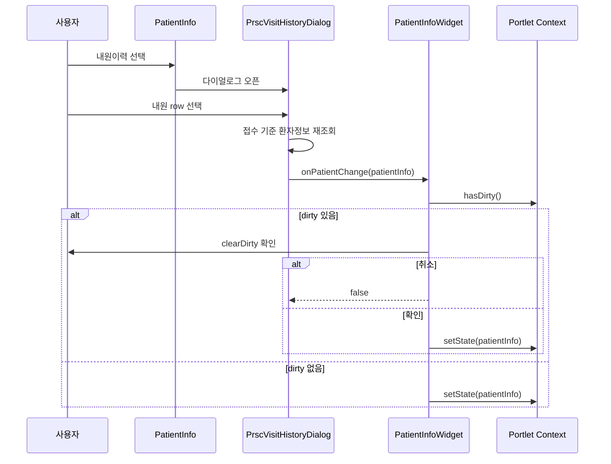

# EMR 포틀릿 환자 변경 안정성

## 왜 필요한가

`PatientInfo`의 `내원이력` 버튼을 통해 선택한 내원 정보가 `PatientInfoWidget`의 `onPatientChange`로 전달될 수 있다.

기존 흐름에서는 `PatientInfoWidget`이 전달받은 환자 정보를 바로 `portlet.setState({ patientInfo })`로 반영하기 때문에, 처방/상병/메모 등 포틀릿 내부 위젯에 미저장 변경사항이 있어도 환자 컨텍스트가 바뀔 수 있었다.

환자 컨텍스트 변경은 임상 업무에서 데이터 유실과 오입력 리스크로 이어질 수 있으므로, 미저장 변경사항 확인은 운영 안정성과 사용자 신뢰에 직접적인 영향을 준다.

## 문제 구조

`PatientInfo`는 `props.ptNb`를 직접 변경하지 않는다.

환자 변경은 상위 컨텍스트 또는 부모 state가 `patientInfo`를 바꾼 뒤, `PatientInfoWrapper`가 `ptNb: props.ptNb || patientInfo.ptNb`로 다시 계산하면서 내려주는 구조다.

진료 계열 내원이력에서는 `PrscVisitHistoryDialog`가 선택 row 기준으로 환자/접수 정보를 재조회한 뒤 `props.onPatientChange(patientInfo, extraState)`를 호출한다.

## 흐름 다이어그램

이 흐름에서 중요한 지점은 `PatientInfo`가 직접 `ptNb`를 바꾸지 않는다는 점이다.

실제 환자 컨텍스트 변경은 `PatientInfoWidget`이 `Portlet Context`를 갱신하면서 발생하므로, dirty gate도 이 지점에 두는 것이 변경 범위를 가장 좁게 유지한다.

## 왜 이 접근을 선택했는가

이미 포틀릿 내부 위젯들은 `portlet.hasDirty()`로 dirty 상태를 등록하고 있었다.

따라서 개별 컴포넌트마다 별도 dirty 로직을 만드는 대신, 포틀릿 공통 dirty 집계 구조를 재사용하는 것이 변경 범위와 유지보수 비용을 줄일 수 있었다.

## 대안과 제외 이유

`PatientInfo` 내부에서 직접 dirty check를 넣는 방법은 위젯 외 사용처까지 영향을 줄 수 있어 범위가 넓다.

`PrscVisitHistoryDialog`만 수정하는 방법은 포틀릿 외부 상태 구조를 알기 어렵고, dirty 집계 책임이 분산될 수 있다.

따라서 환자 컨텍스트를 실제로 변경하는 `PatientInfoWidget.onPatientChange`를 guard 지점으로 선택했다.

## 어떻게 해결했는가

`common/klago-ui-hospital-common/src/widget/components/PatientInfoWidget.js`

- `ConfirmMessageEnum`, `OBTPageContainer`를 추가했다.
- `onPatientChange`를 `async` 함수로 변경했다.
- 환자 변경 전에 `portlet.hasDirty?.()`를 호출한다.
- dirty가 있으면 `ConfirmMessageEnum.clearDirty` 확인창을 띄운다.
- 사용자가 취소하면 `false`를 반환하고 `portlet.setState`를 실행하지 않는다.
- 사용자가 확인하면 기존처럼 `patientInfo`와 `extraState`를 `portlet.setState`로 반영한다.

## 기대효과

사용자가 내원이력으로 환자를 바꾸는 과정에서 미저장 처방/상병/메모가 의도치 않게 사라지는 상황을 줄일 수 있다.

포틀릿 공통 dirty 집계 구조를 활용하므로 개별 위젯의 dirty 상태를 중복으로 추적하지 않아도 된다.

## 기술적 가치

환자 컨텍스트 변경 경로에 일관된 guard를 추가했다.

상태 변경 책임이 있는 `PatientInfoWidget`에서 dirty 확인을 수행해 변경 범위를 좁혔다.

`PatientInfo`, `PrscVisitHistoryDialog`, `PatientInfoWidget`, `Portlet` 사이의 데이터 흐름을 추적해 안전한 개입 지점을 식별했다.

## 비즈니스 가치

진료 업무 중 데이터 유실 가능성을 낮추고, 의료진의 환자 전환 작업에서 안전성을 높인다.

환자 정보 전환 과정에서 사용자가 미저장 변경사항을 인지할 수 있어 임상 업무 신뢰성을 높일 수 있다.

## 트레이드오프

`PatientInfoWidget`에서 dirty 확인을 수행하면 환자 컨텍스트 변경 자체는 막을 수 있다.

다만 환자 변경을 발생시키는 하위 다이얼로그가 비동기 결과를 존중하지 않으면, 상태 변경 방지와 UI 닫힘 방지가 분리될 수 있다.

최종적으로는 호출자와 피호출자 사이의 `Promise<boolean>` 계약을 명확히 하는 것이 유지보수에 유리하다.

## 남은 리스크

현재 파일 상태 기준으로 `PrscVisitHistory.js`는 `this.props.onPatientChange?.(...)`를 `await`하지 않고, 바로 `this.props.onConfirm(patientInfo)`를 호출한다.

따라서 `PatientInfoWidget.onPatientChange`가 dirty 취소로 `false`를 반환하더라도, `PrscVisitHistoryDialog` 쪽에서 그 값을 기다리거나 확인하지 않으면 다이얼로그가 닫히는 흐름이 남을 수 있다.

## 재사용 가능한 패턴

상위 컨텍스트를 실제로 변경하는 지점을 dirty gate로 삼는다.

하위 컴포넌트가 여러 사용처를 가지는 경우, 하위 컴포넌트에 업무별 dirty 정책을 직접 넣기보다 상위 컨텍스트 변경 함수에서 guard를 둔다.

비동기 콜백으로 상태 변경 허용 여부를 반환할 때는 호출자가 `await`하고 `false`를 계약으로 존중해야 한다.

## 검증 방법

작업 중 수행한 검증:

- `git diff --check`로 공백 오류 확인
- 수정 대상 파일 2개를 Babel로 컴파일 확인

현재 재확인 기준:

- `PatientInfoWidget.js`에는 dirty gate가 존재한다.
- `PrscVisitHistory.js`에는 `onPatientChange` 결과 대기 로직이 현재 반영되어 있지 않다.

## 커리어 서사 후보

EMR 진료 메인에서 환자 전환 시 미저장 데이터가 유실될 수 있는 경로를 찾아, 기존 포틀릿 dirty 집계 구조를 활용해 환자 변경 전에 사용자 확인을 거치도록 개선했다.

단일 컴포넌트 수정이 아니라 포틀릿 컨텍스트, 환자 정보 위젯, 내원이력 다이얼로그 사이의 비동기 상태 변경 계약을 추적해 안전한 변경 지점을 판단했다.
