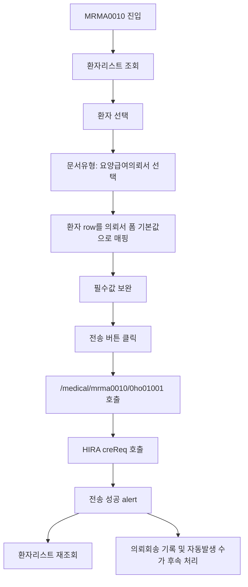

# MRMA0010 요양급여의뢰서 테스트 프로세스

## 왜 필요한가

MRMA0010은 단순 입력 화면이 아니라 환자 진료정보, 상병, 요양기관, 의뢰 사유, 첨부문서, HIRA 전송, 의뢰회송 기록, 자동발생 수가가 이어지는 메뉴다.

따라서 테스트도 화면 표시 여부만 보면 부족하다. 환자 선택 데이터가 의뢰서 폼으로 올바르게 흘러가고, 필수값 검증을 통과한 뒤, 전송 성공 후 환자리스트 상태와 후속 기록이 자연스럽게 이어지는지 확인해야 한다.

## 메뉴의 역할과 목적

MRMA0010의 목적은 진료 중인 환자를 기준으로 요양급여의뢰서 또는 요양급여회송서를 작성하고 HIRA 진료의뢰·회송 API로 전송하는 것이다.

이 메뉴는 다음 역할을 가진다.

- 의뢰·회송 대상 환자 목록을 조회한다.
- 선택 환자의 환자정보, 진료과, 담당의, 상병 정보를 의뢰서 폼 기본값으로 변환한다.
- 의뢰 사유, 주호소, 의뢰받을 요양기관, 진료소견, 진료협력센터 담당자 정보를 입력받는다.
- 요양급여의뢰서를 HIRA API로 전송한다.
- 전송 성공 후 의뢰회송 기록, 자동발생 수가, 첨부문서/PACS 연결 같은 후속 처리를 수행한다.

## 프로세스 흐름

## 화면 구성

좌측 환자리스트는 조회 조건을 기준으로 대상 환자를 불러온다. 조회 API는 `/medical/mrma0010/0ho00004`이고, 결과는 전체, 대기, 완료 상태로 나뉜다.

중앙 접수정보 영역은 문서유형을 선택하는 역할을 한다. 현재 문서유형 목록은 고정 목록이며, `요양급여의뢰서`를 선택해야 우측에 의뢰서 폼이 열린다.

우측 의뢰서 폼은 `ReferralFormBase`가 담당한다. 선택된 환자 row를 `mapPatientInfoToReferralForm`으로 변환하여 환자번호, 성명, 주민번호, 전화번호, 상병, 진료과, 담당의, 면허번호 등을 기본값으로 채운다.

## 테스트 전제 조건

- 로컬 프론트가 `http://localhost:3000`에서 실행 중이어야 한다.
- MRMA0010 메뉴에 접근 가능한 계정으로 로그인해야 한다.
- 환자리스트에서 조회 가능한 의뢰·회송 대상 환자가 있어야 한다.
- 환자 row에 전송 필수값의 기반 데이터가 있어야 한다.
- 병원 환경설정에 요양기관기호와 병원명이 있어야 한다.
- 자동발생 수가까지 확인하려면 사업장 법정동코드와 의뢰회송 수가 규칙이 준비되어 있어야 한다.

## 수동 테스트 방법

1. `http://localhost:3000/#/MRM/MRMA0010/MRMA0010`으로 진입한다.
2. 조회일자, 환자명, 진료과, 진료의를 조건으로 환자리스트를 조회한다.
3. `대기` 상태 환자를 선택한다.
4. 중앙 접수정보에서 `요양급여의뢰서`를 선택한다.
5. 우측 의뢰서 폼의 자동 매핑값을 확인한다.
6. 의뢰 사유를 선택한다.
7. 주호소를 입력한다.
8. 의심되는 상병을 확인하거나 입력한다.
9. 의뢰받을 요양기관 명칭을 코드도움으로 선택한다.
10. 의뢰받을 진료과를 확인한다.
11. 진료소견을 입력한다.
12. 긴급진료필요가 `Y`이면 긴급진료필요 사유를 입력한다.
13. 담당의사 성명과 면허번호를 확인한다.
14. 진료협력센터 담당자 성명과 연락처를 입력한다.
15. `전송` 버튼을 누른다.
16. `전송되었습니다.` 메시지를 확인한다.
17. 환자리스트가 재조회되고 해당 환자의 상태가 완료로 바뀌는지 확인한다.

## 자동화 테스트 방법

자동화 스크립트는 다음 위치에 있다.

`/Users/woosung/.codex/skills/playwright-cli/scripts/run-mrma0010-yoyang-geubyeo-uiroe.sh`

필수 환경변수는 다음과 같다.

- `AMARANTH10_ID`
- `AMARANTH10_PASSWORD`

선택 환경변수는 다음과 같다.

- `AMARANTH10_BASE_URL`
- `PLAYWRIGHT_SESSION`
- `CHIEF_COMPLAINT`
- `REFERRAL_OPINION`
- `PARTNER_NAME`
- `PARTNER_TEL`
- `RCV_YADM_NAME`
- `WAIT_MS`

현재 자동화는 환자 선택과 `요양급여의뢰서` 문서 선택 이후부터 안정적이다. 스크립트는 화면에 `의뢰 기본정보`가 보이지 않으면 실패로 처리한다.

## 자동화가 검증하는 것

- MRMA0010 URL 진입과 로그인 흐름
- `의뢰 기본정보` 영역 노출 여부
- `의뢰 사유` 중 `진단의뢰` 체크
- `주호소` 입력
- `의뢰받을 요양기관 명칭` 선택
- `진료소견` 입력
- `(진료협력센터) 담당자 성명` 입력
- `(진료협력센터) 담당자 연락처` 입력
- `전송` 버튼 클릭
- `전송되었습니다.` 성공 문구 확인

## 반드시 추가로 봐야 하는 리스크

### 환자 선택과 문서 선택은 아직 완전 자동화가 아니다

현재 자동화는 의뢰서 폼이 이미 열린 상태를 전제로 한다. 환자 선택과 문서유형 선택까지 포함한 완전 자동화를 만들려면 환자리스트 행 선택, 중앙 문서유형 그리드 선택, 우측 폼 로딩 확인을 별도 단계로 넣어야 한다.

### 필수값은 환자 row 품질에 의존한다

환자 전화번호, 상병, 담당의 면허번호, 진료과 코드가 비어 있으면 자동 매핑만으로 전송 검증을 통과하지 못한다. 테스트 환자는 필수값 기반 데이터가 충분한 환자로 골라야 한다.

### 긴급진료필요 사유가 누락될 수 있다

폼 기본값에서 긴급진료필요가 `Y`로 잡히면 `긴급진료필요 사유`가 필수다. 자동화 스크립트가 이 값을 채우지 않으면 validation에서 막힐 수 있다.

### 상태 변경은 성공 alert만으로 충분하지 않다

성공 문구는 HIRA 전송 성공을 확인하는 첫 번째 신호다. 실제 업무 검증은 환자리스트 재조회 후 상태가 `완료`로 바뀌는지, 의뢰회송 기록이 저장되는지, 자동발생 수가가 중복 없이 생성되는지까지 봐야 한다.

## 다음에 재사용할 기준

MRMA0010을 테스트할 때는 항상 다음 순서로 본다.

1. 환자 조회 조건과 대상 환자 데이터가 충분한가
2. 환자 row가 의뢰서 폼 필드로 정상 매핑되는가
3. 화면 필수값 검증을 통과하는가
4. 전송 API가 성공 응답을 주는가
5. 성공 후 환자리스트와 후속 기록이 일관되게 바뀌는가
6. 실패 시 어떤 필드, 어떤 API, 어떤 후속 처리에서 끊겼는가

이 기준을 지키면 MRMA0010 테스트는 단순 클릭 자동화가 아니라 업무 프로세스 검증으로 사용할 수 있다.
